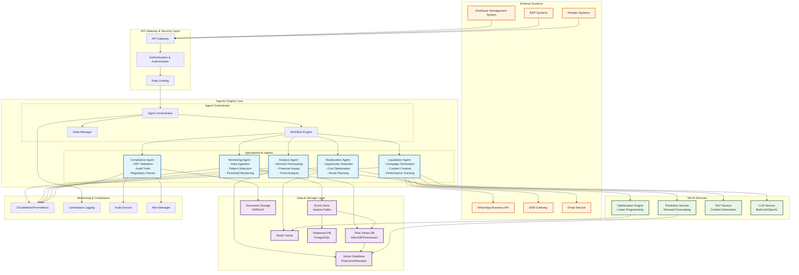

# Design Document: VyaparSahayak Distributor

## Overview

VyaparSahayak Distributor is an agentic AI engine designed to autonomously manage dead stock across the FMCG supply chain in India. The system employs a multi-agent architecture where specialized AI agents continuously monitor inventory patterns, reason about reallocation opportunities, and execute liquidation campaigns without human intervention.

The engine integrates with existing distributor management systems to access real-time sales and inventory data from 500-5,000+ retail outlets. Using event-driven architecture and machine learning models, it proactively identifies dead stock situations, calculates optimal interventions, and automatically executes corrective actions while maintaining full GST compliance and audit trails.

Key design principles include autonomous operation, scalable multi-tenancy, real-time responsiveness, and seamless integration with existing FMCG distribution infrastructure.

## Architecture

### High-Level Architecture

The system follows a microservices-based, event-driven architecture with specialized AI agents operating autonomously within defined boundaries. The architecture supports horizontal scaling and multi-tenant isolation while maintaining real-time responsiveness.



### Agent Architecture

Each agent operates as an autonomous microservice with specific responsibilities:

**Monitoring Agent**: Continuously ingests and processes sales/inventory data, detecting anomalies and triggering events when dead stock patterns emerge.

**Analysis Agent**: Performs deep analysis of inventory patterns, demand forecasting, and financial impact calculations using machine learning models.

**Reallocation Agent**: Reasons about optimal inventory redistribution across territories, considering transportation costs, demand patterns, and regulatory constraints.

**Liquidation Agent**: Generates and executes targeted clearance campaigns, managing pricing strategies, promotional content, and campaign performance tracking.

**Compliance Agent**: Ensures all actions maintain GST compliance, generates audit trails, and manages regulatory documentation.

### Event-Driven Communication

Agents communicate through an event-driven architecture using Apache Kafka for high-throughput, fault-tolerant messaging. Events include:

- `InventoryUpdated`: Real-time inventory level changes
- `DeadStockDetected`: Threshold breaches requiring action
- `ReallocationOpportunity`: Cross-territory optimization opportunities
- `CampaignTriggered`: Liquidation campaign initiation
- `ComplianceViolation`: Regulatory requirement breaches

## Components and Interfaces

### Core Components

**Agent Orchestrator**
- Manages agent lifecycle and coordination
- Implements workflow execution and state management
- Provides agent communication and event routing
- Handles error recovery and failover scenarios

**Data Integration Layer**
- Connects to existing DMS/ERP systems via REST APIs and webhooks
- Normalizes data from multiple sources with varying schemas
- Implements real-time data streaming and batch processing
- Manages data quality validation and error handling

**Machine Learning Pipeline**
- Demand forecasting models using time series analysis
- Dead stock prediction using ensemble methods
- Optimization algorithms for reallocation and pricing
- Natural language processing for campaign content generation

**Campaign Execution Engine**
- Multi-channel communication (WhatsApp Business API, SMS, Email)
- Dynamic pricing and promotional content generation
- A/B testing framework for campaign optimization
- Performance tracking and ROI measurement

### External Interfaces

**Distributor Management System Integration**
```
GET /api/v1/inventory/current
POST /api/v1/sales/batch
GET /api/v1/retailers/{id}/sales-history
PUT /api/v1/inventory/{sku}/reallocation
```

**Communication Channel APIs**
```
POST /whatsapp/v1/messages/broadcast
POST /sms/v1/campaigns/create
POST /email/v1/templates/send
GET /campaigns/{id}/analytics
```

**Compliance and Audit APIs**
```
GET /gst/v1/compliance-check
POST /audit/v1/trail/create
GET /reports/v1/regulatory/{period}
```

## Data Models

### Core Entities

**Distributor**
```json
{
  "distributorId": "string",
  "name": "string",
  "territories": ["string"],
  "retailerCount": "number",
  "gstNumber": "string",
  "businessRules": {
    "deadStockThreshold": "number",
    "expiryHorizonDays": "number",
    "reallocationRadius": "number"
  }
}
```

**Inventory Item**
```json
{
  "sku": "string",
  "distributorId": "string",
  "territory": "string",
  "currentStock": "number",
  "reservedStock": "number",
  "expiryDate": "datetime",
  "lastMovementDate": "datetime",
  "averageDailySales": "number",
  "deadStockScore": "number",
  "status": "enum[active, slow_moving, dead, liquidating]"
}
```

**Sales Transaction**
```json
{
  "transactionId": "string",
  "retailerId": "string",
  "sku": "string",
  "quantity": "number",
  "unitPrice": "number",
  "timestamp": "datetime",
  "territory": "string",
  "gstDetails": "object"
}
```

**Reallocation Recommendation**
```json
{
  "recommendationId": "string",
  "sourceSku": "string",
  "sourceTerritory": "string",
  "targetTerritory": "string",
  "quantity": "number",
  "transportationCost": "number",
  "expectedRevenue": "number",
  "urgencyScore": "number",
  "complianceStatus": "enum[compliant, requires_review]"
}
```

**Liquidation Campaign**
```json
{
  "campaignId": "string",
  "skus": ["string"],
  "targetRetailers": ["string"],
  "discountPercentage": "number",
  "channels": ["enum[whatsapp, sms, email]"],
  "content": "object",
  "startDate": "datetime",
  "endDate": "datetime",
  "performanceMetrics": {
    "impressions": "number",
    "clicks": "number",
    "conversions": "number",
    "revenueGenerated": "number"
  }
}
```

### Event Schemas

**DeadStockDetectedEvent**
```json
{
  "eventId": "string",
  "timestamp": "datetime",
  "distributorId": "string",
  "sku": "string",
  "territory": "string",
  "deadStockScore": "number",
  "daysWithoutMovement": "number",
  "financialImpact": "number",
  "recommendedActions": ["string"]
}
```

**ReallocationExecutedEvent**
```json
{
  "eventId": "string",
  "timestamp": "datetime",
  "recommendationId": "string",
  "executionStatus": "enum[success, failed, partial]",
  "actualQuantity": "number",
  "actualCost": "number",
  "complianceDocuments": ["string"]
}
```

## Correctness Properties

*A property is a characteristic or behavior that should hold true across all valid executions of a system—essentially, a formal statement about what the system should do. Properties serve as the bridge between human-readable specifications and machine-verifiable correctness guarantees.*

After analyzing the acceptance criteria, I've identified several properties that can be consolidated to eliminate redundancy while maintaining comprehensive coverage:

### Property Reflection

Several properties were identified as logically redundant or combinable:
- Properties for different types of cost calculations (1.5, 2.2, 6.1) can be combined into comprehensive financial calculation properties
- Properties for various alert types (5.1, 5.2, 5.3) can be consolidated into comprehensive notification properties  
- Properties for different compliance aspects (2.4, 7.2, 7.3) can be combined into comprehensive compliance properties
- Properties for different data processing aspects (4.3, 4.4) can be consolidated into comprehensive data handling properties

### Core Properties

**Property 1: Dead Stock Detection Accuracy**
*For any* inventory dataset with sales history, when the system analyzes slow-moving patterns, all items flagged as dead stock should meet the configured threshold criteria for movement velocity and time periods.
**Validates: Requirements 1.1, 1.2**

**Property 2: Expiry-Based Prioritization**
*For any* set of inventory items with varying expiry dates, items approaching the configured expiry horizon should receive higher priority scores than items with longer shelf life.
**Validates: Requirements 1.3**

**Property 3: Cross-Dimensional Aggregation Consistency**
*For any* dead stock data across territories, outlets, and SKU categories, the aggregated totals should equal the sum of individual components across all dimensions.
**Validates: Requirements 1.4**

**Property 4: Financial Impact Calculation Completeness**
*For any* dead stock scenario, the calculated financial impact should include all specified cost components (carrying costs, opportunity costs, disposal costs, transportation costs) and produce mathematically consistent results.
**Validates: Requirements 1.5, 2.2, 6.1, 6.2**

**Property 5: Demand Mismatch Detection**
*For any* inventory distribution across territories, when demand patterns vary significantly between locations, the system should correctly identify reallocation opportunities that maximize overall demand satisfaction.
**Validates: Requirements 2.1**

**Property 6: Multi-Criteria Prioritization Consistency**
*For any* set of reallocation opportunities, the prioritization ranking should consistently reflect the weighted combination of proximity, demand velocity, and expiry urgency factors.
**Validates: Requirements 2.3**

**Property 7: Compliance Validation Completeness**
*For any* transaction or transfer scenario, all compliance checks (GST requirements, regulatory documentation, audit trails) should be validated and any violations should be flagged before execution.
**Validates: Requirements 2.4, 7.2, 7.3, 7.5**

**Property 8: Learning and Adaptation Effectiveness**
*For any* sequence of reallocation or campaign executions, the system should track outcomes and demonstrate measurable improvement in success rates over time.
**Validates: Requirements 2.5, 3.5**

**Property 9: Campaign Generation Appropriateness**
*For any* dead stock liquidation scenario, generated campaigns should target appropriate retailer segments, use compliant pricing strategies, and select optimal communication channels based on targeting criteria.
**Validates: Requirements 3.1, 3.2, 3.3**

**Property 10: Performance Metrics Tracking Accuracy**
*For any* executed campaign, all specified performance metrics (response rates, conversion rates, stock clearance velocity) should be accurately tracked and calculated from the underlying interaction data.
**Validates: Requirements 3.4**

**Property 11: Data Integration and Normalization Robustness**
*For any* data from external systems with varying quality and formats, the integration process should normalize data to consistent schemas while preserving semantic meaning and flagging quality issues.
**Validates: Requirements 4.1, 4.3, 4.4**

**Property 12: Predictive Analysis Consistency**
*For any* historical returns and sales pattern data, predictions for future dead stock should be based on statistically valid trend analysis and seasonal patterns.
**Validates: Requirements 4.2, 4.5**

**Property 13: Alert System Completeness**
*For any* threshold breach or urgent condition, the alert system should generate notifications with appropriate urgency levels, include recommended actions, and deliver to correctly identified stakeholders based on their roles and preferences.
**Validates: Requirements 5.1, 5.2, 5.3, 5.4, 5.5**

**Property 14: Reporting Accuracy and Insight Generation**
*For any* time period and data scope, generated reports should contain accurate trend analysis, comparative metrics across dimensions, and actionable insights that are relevant to the target audience.
**Validates: Requirements 6.3, 6.4, 6.5**

**Property 15: Audit Trail Completeness**
*For any* system operation involving inventory movements, pricing changes, or promotional activities, complete audit logs should be maintained with all required details for regulatory compliance.
**Validates: Requirements 7.1**

**Property 16: Multi-Tenant Isolation and Customization**
*For any* multi-tenant deployment, each distributor's data should be completely isolated, and tenant-specific configurations (business rules, workflows, alerts) should be properly applied without cross-tenant interference.
**Validates: Requirements 8.2, 8.3, 8.5**

## Error Handling

The system implements comprehensive error handling across all components:

**Data Integration Errors**
- Graceful degradation when external systems are unavailable
- Data validation with detailed error reporting for malformed inputs
- Automatic retry mechanisms with exponential backoff for transient failures
- Fallback to cached data when real-time sources are inaccessible

**Agent Communication Errors**
- Circuit breaker patterns to prevent cascade failures
- Dead letter queues for failed event processing
- Automatic agent restart and state recovery mechanisms
- Cross-agent coordination failure detection and resolution

**Business Logic Errors**
- Validation of business rules before executing actions
- Rollback mechanisms for partially completed operations
- Conflict resolution for concurrent operations on the same inventory
- Escalation procedures for scenarios requiring human intervention

**External Service Errors**
- Timeout handling for communication channel APIs
- Alternative channel selection when primary channels fail
- Compliance service fallback procedures
- Rate limiting and quota management for external APIs

## Testing Strategy

The testing approach combines comprehensive unit testing with property-based testing to ensure both specific behavior validation and universal correctness guarantees.

**Unit Testing Focus**
- Integration points between agents and external systems
- Specific business rule implementations and edge cases
- Error handling scenarios and recovery mechanisms
- Multi-tenant configuration and data isolation
- Campaign content generation and compliance validation

**Property-Based Testing Configuration**
- Framework: Hypothesis (Python) for ML services, fast-check (TypeScript) for API services
- Minimum 100 iterations per property test to ensure statistical confidence
- Custom generators for domain-specific data (inventory items, sales transactions, retailer profiles)
- Shrinking strategies to identify minimal failing cases
- Each property test tagged with: **Feature: vyapar-sahayak-distributor, Property {number}: {property_text}**

**Integration Testing**
- End-to-end workflows from data ingestion to campaign execution
- Multi-agent coordination scenarios
- External system integration with mock services
- Performance testing under realistic load conditions
- Compliance validation with regulatory test scenarios

**Monitoring and Observability**
- Real-time metrics for agent performance and system health
- Distributed tracing for cross-service operations
- Business metrics tracking (dead stock reduction, campaign effectiveness)
- Alerting for system anomalies and business threshold breaches
- Audit log analysis and compliance reporting